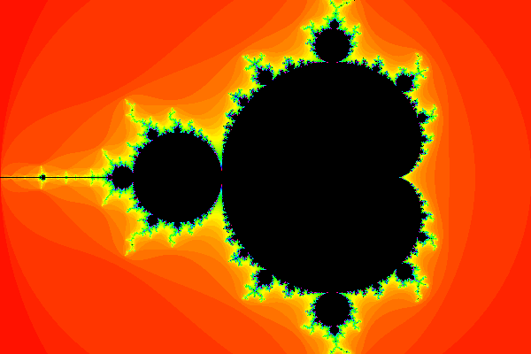
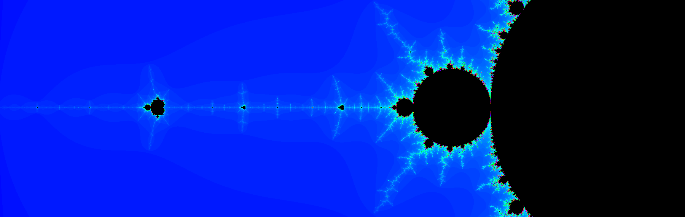

## mandel-brot-set 
The project consists of several parts, including:
1- Project algorithm design with Python
2- Project design with C
3- Production of suitable soundtrack for the project
4- Writing a blog for different parts of this project

To carry out this project, we must first have a general view of the function of the Mendel-Brot 
function and its features, which we could have achieved with a little search or a complete study
of the professor's document.

The initial step was to write the Python code. Entering the Python code gave a very good overview
of the algorithm and made us take the right path algorithmically, in addition to the fact that in
Python we had to use the pillow library to generate the image, which made image generation much
easier. And we did not get involved in image design and its difficulties. In general, Python code
was the best way to understand the algorithm and general work of this project.

To write the Python code, I went to different parts such as different types of coloring or
different types of features for MendelBrot set function. In some stages, I tried to be 
creative and implement a new idea. For example, in the implementation of the zoom function.
I combined it with changing the center so that the zoom function needed the destination point
and the zoom value for its input. This function works differently from the function written in C language.
We can see the example of the photo produced in python language below:

Project programming with C language:
Programming with C language was due to the fact that using the pillow library as well as calculating
the iteration of each pixel was slow (compared to C language), so we went to use C language to
create images without using any library as well as Faster calculation, increase processing speed.
Writing a program in C language had its own challenges. Among these challenges, I can mention the following:

1- The most elementary challenge was writing MendelBrot set general algorithm and the reason for that
was not using the complex numbers library in C language.
2- Writing general algorithms using structures made the work a little more difficult than Python language.
3- To run the program, it was necessary to read the config file and for this we had to complete the code
related to this section.
4- After completing the above steps, we encountered several problems in outputting photos. I can point to 
the infinite production of photos, the output of a photo without any visual content (empty photo), the 
output of a black photo in all functions, the splitting of the photo into two parts (due to the wrong
implementation of the inverse tangent function), other minor errors. 
5- Adding new functions to the program that can ultimately improve the overall video.

After a lot of debugging, we were able to remove these problems step by step and reach a good output.
We can see a sample photo produced with C below:

Another problem that I had to produce the final photo was that I went to one of the existing sites
to find interesting images for this purpose, but the problem was that the length to width ratio of
that site was almost 3 to 1, while the ratio of The length to width of my image was 3 to 2, but this
problem was not a big problem because by changing the number of pixels of the image from 1200x1800
to 1800x574, I was able to fix the overall dimensions. This made the images not look stretched.
The size of each image produced with C language is approximately 0.98 Mb.

After all this, it was time to produce a suitable soundtrack for the project.
To produce music, we had to use the sonicpi program, and this program had various functions like c
or python and supported various instruments. I chose music that could match my final video.
I ended up with four songs and outputted them with minor changes to one or two of them.

Finally, I output the final video with different fps. At first, I set it to 5, but because the video
time was too long and there was a kind of discontinuity of images in the video, I set the fps of the
 video to 20 and output it with the final music.

